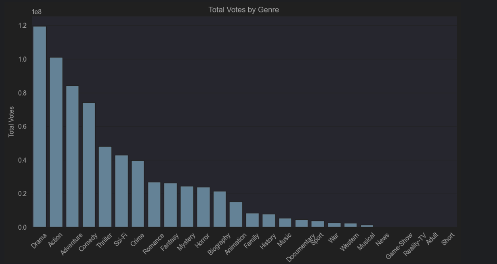
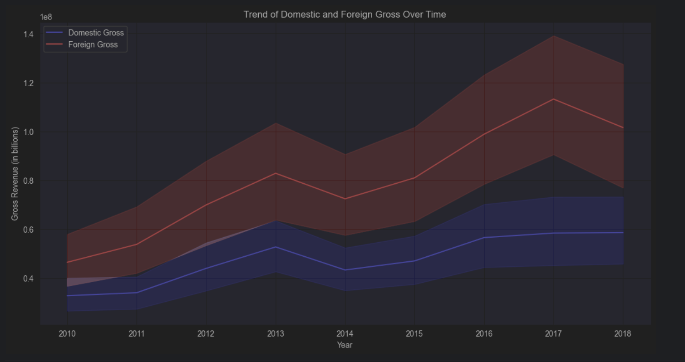

# Movie Box Office and IMDb Analysis
## Overview
This project aims to analyze movie box office data alongside IMDb data to provide actionable insights for a new movie studio. By examining trends in domestic and foreign grosses, IMDb ratings, and genres, we aim to understand what types of films perform well at the box office and offer recommendations for future productions.

## Business Understanding
The goal is to help a new movie studio understand the box office landscape. The studio wants to create original video content but lacks experience in movie production. By analyzing historical box office and IMDb data, we aim to identify trends and patterns that can guide the studio in making informed decisions about the types of films to produce.

## Data Understanding
The dataset contains information about various movies, including their title, studio, domestic gross, foreign gross, and release year, along with additional data from IMDb such as genres, ratings, and votes. This data allows us to analyze the performance of different studios and movies over time and understand the distribution of grosses across different markets.

## Source of Data
1. ### Box Office Data: Sourced from bom.movie_gross.csv, containing the following columns:

   - `title`: The title of the movie
   - `studio`: The studio that produced the movie
   - `domestic_gross`: Box office revenue from the domestic market (home country)
   - `foreign_gross`: Box office revenue from foreign markets (outside home country)
   - `year`: The year the movie was released
2. ### IMDb Data: Sourced from an SQLite database im.db, containing the following columns:

    - `movie_id`: Unique identifier for the movie
    - `primary_title`: The title of the movie
    - `genres`: The genre(s) of the movie
    - `start_year`: The year the movie was released
    - `averagerating`: The average IMDb rating of the movie
    - `numvotes`: The number of votes the movie received on IMDb
## Description of Data
The combined dataset includes:
- `title`: The title of the movie
- `studio`: The studio that produced the movie
- `domestic_gross`: Box office revenue from the domestic market
- `foreign_gross`: Box office revenue from foreign markets
- `year`: The year of release
- `primary_title`: The primary title of the movie (from IMDb)
- `genres`: The genre(s) of the movie
- `start_year`: The year of release (from IMDb)
- `averagerating`: The average IMDb rating of the movie
- `numvotes`: The number of votes the movie received on IMDb
## Data Preprocessing
- Conversion to Numeric Types: Domestic and foreign gross values were converted to numeric types to ensure accurate calculations.
- Handling Missing Values: Rows with missing gross values were dropped.
- Adding Total Gross: A new column total_gross was added, representing the sum of domestic and foreign grosses.

## Visualizations
### Average Rating by Genre
This visualization shows the average IMDb rating for each genre, providing insights into which genres are most favorably received by audiences.


### Total Votes by Genre
This visualization shows the total number of votes for each genre on IMDb, highlighting the genres that attract the most audience engagement.


### Trend of Domestic and Foreign Gross Over Time
This visualization shows how domestic and foreign grosses have evolved year by year, highlighting trends in movie performance in different markets.


## Conclusion
### Summary of Findings
Increasing Foreign and Domestic Gross Over Time: This upward trend suggests a growing market for movies.
High-Rated Genres: While genres like Short, Documentaries, Game-Show, and News have high average ratings, they have a relatively low number of votes. This indicates that although these genres are highly rated, their fan base is quite small.
Engaging Genres: Drama, Action, Adventure, and Comedy genres receive the highest number of votes. This high vote count indicates that these genres have a large and dedicated fan base.
## Recommendations
By focusing on producing movies in popular genres with a large fan base and creating films that appeal to both local and international audiences, our new movie studio has a high chance of success.

# How to Run the project
1. ### Install all the required dependencies
   Make sure you have `pip` installed. Then, run the following command in your terminal to install all necessary packages:

   ```shell
   pip install -r requirements.txt
   ```

2. ### Prepare the data
   Copy the `im.db.zip` file from the `dsc-phase-2-project-v3/zippedData` directory. Unzip this file and place the resulting `im.db` file in the `data` folder of your project directory.

3. ### Run the Jupyter Notebook
   Launch Jupyter Notebook by running the following command in your terminal:

   ```shell
   jupyter notebook
   ```
   Open the `notebook.ipynb` file and run the cells to execute the project code.
